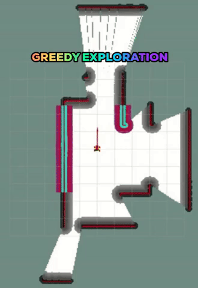
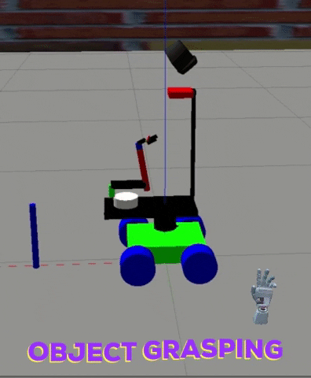
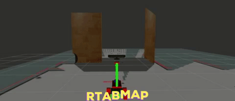
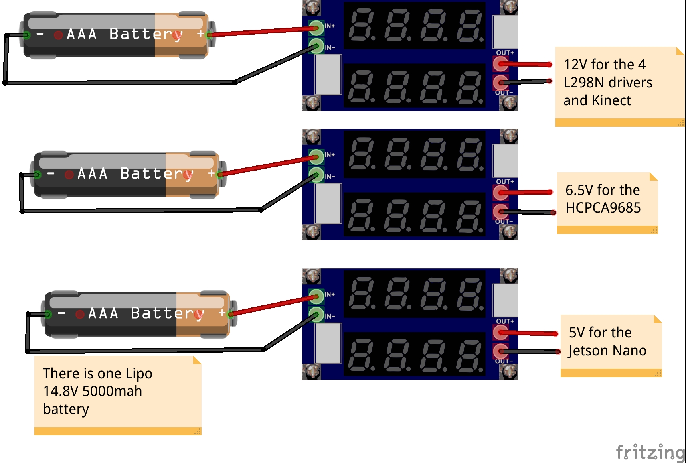

# Open Mobile Manipulator Project

## Description

This project is meant to help you with creating your own **cheap education Mobile Manipulator**, both in simulation and on reality!!

This can help you to learn 

**Move-it, Navigation, Rtabmap, Amcl and the hardware interface of a real robot and much more** 

##Some GIFS

#### On Simulated robot

**Autonomous SLAM - gmapping - move_base - greedy exploration**

**3D Perception Extract Features - color HSV - Surface Normals in histogram format**

**3D Perception - recognize objects with labels and TF**

**Gazebo Grasping sequence, out of the way**

**RTAB-Mapping in a feaure rich simulated Gazebo world**

#### On Real Robot

**Autonomous Navigation - Move_base - AMCL**

**Real Arm Motion**

**3D Mapping my home with RTAB-Map**

**Robot-Kidnap Localization with RTAB-Map**

## Youtube Videos

[**Autonomous Navigation - AMCL - Move_Base- MoveIt - Video**](https://www.youtube.com/watch?v=-vyhhE-3uxY&feature=emb_logo)

**P.S 1. The robot is a little slow, because i had some problems with the motors and i did it in a hurry, but expect stable behaviour with speeds ~0.4-0.6 m/s**

**P.S 2. At approximately 5 mins on the video you can see how the arm moves**

[**RtabMap - 3D mapping - Localization -Robot Kidnap**](https://www.youtube.com/watch?v=4myLogrLsiE&feature=emb_logo)

**Here you can see the robot mapping a real 3D environment with RTAB-Map and after we have the map in memory it can solve the robot Kidnap localization problem!!!**

## For real robot run the command

**$ roslaunch ommp_bringup real_bringup.launch**

**In order to launch the robot description, controllers - hardware interface for the arm, rosserial and sensor drivers**

**ssh -X username@192.168.1.2** (to login in the jetson)

**export ROS_MASTER_URI=**http://mia:11311/ (on the terminal of the pc to run the rviz in the PC)

**maybe export ROS_IP=192.168.1.2 accordingly on the .bashrc of the computer and jetson Nano**

## For simulation

**$ roslaunch ommp_simulation sim_bringup.launch**

**To again launch the robot in the Gazebo alongside the controllers etc..**

**Then you can try for example the following commands**

**$ roslaunch ommp_bringup moveit.launch**
**$ rosrun ommp_bringup set_start_pos.py**

**$ roslaunch ommp_bringup gmapping.launch**

**$ roslaunch ommp_bringup teleop.launch**

## Scripting

**Instead of opening multiple terminals and writing the commands 1 by 1 and then changing the rviz config etc..**

**It is a good practice to use script files to launch automatically multiple terminals with your desired commands by simple running the script**

**To that end you can go to ( $ roscd safe_spawner ) there you will find some scripts - demos that you can run, for example**

**1. $ ./safe_spawner_exploration.sh** to map automatically a new gazebo world with move_base, gmapping and a greedy exploration node

**2. $ ./safe_spawner_object_recognition.sh** to spawn the robot in a world with some object that you can recognize.

**3. $ ./safe_spawner_rtabmap_mapping.sh** to spawn the robot in a feature rich world in order to perform 3D mapping with teleop commands.

**I will make more of this in the feature**

## One Problem

**If you look at these scripts you will notice that we first spawn the robot and controllers to Gazebo, OK!! but i have to necessarilly run moveit otherwise i cannot properly see the robot in RVIZ, also the planning_scene display needs to be active in RVIZ in order to visualize the robot, and to avoid duplicate robots don't activate the RobotState display**

**Furthermore,  i run a set_start_pos node for the arm, because with the effort controllers the arm is spawned in an awkward position this command fixes it and puts it into a nice starting and stable location**

**Lastly, the kinect is spawned with a pitch of 0.5 looking down, this is to help with the object recognition, but for example when mapping with RTAB-Map you would want the kinect facing horizontally, if you look at the associating script we publish a command on the position controller of the kinect joint in order to do that**

## URDF of the robot

**Under the package ommp_description/urdf/robots/lynxbot/ you can find the main xacro of the robot**

**I tried to make the xacro as easy to modify as possible, in order to quickly set up your costum mobile manipulators P.S I would like to see them**

**On the same dir you can find the common_properties.xacro where are some global variables that are available for all the macros, for example position of the lidar,kinect,arm etc size of the robot base etc.**

**On the bases macros you can find the robot_footprint alongside upper level, kinect bases etc**

**On the common_properties there is arg sim, this defines whether we include the gazebo.xacro that are needed on the simulation but not on the real robot, for example ros_control_plugin and gazebo_sensor_macros. Furthermore when we include for example the kinect xacro file this argument get's passed there and this file will decide if it will include the kinect.gazeb0 xacro-plugin and whether it will instantiate this gazebo macro**
## 3D Perception

**Step 1 : Extract Features**

**$ roslaunch sensor_stick training.launch**

This will a simple Gazebo world with sensor stick and an RGB camera

Then you can run the node capture features which will spawn the objects in random orientations and extract the features, when this node is done it will output a training_set.sav file.

**$ rosrun sensor_stick capture_features.py**

Have a look at this node, more orientation the better, you can add your own models at sensor_stick/models  directory put at your bashrc the following 

export GAZEBO_MODEL_PATH=~/catkin_ws/src/Open_Mobile_Manipulator/sensor_stick/models:$GAZEBO_MODEL_PATH

P.S you can also download the osrf gazebo models (optional)

**Step 2: Train the SVM classifier**

Then with the training_set.sav file ready we are ready to train our SVM classifier. Run the node

**$ rosrun sensor_stick train_svm.py**

Make sure, the training_set.sav is in a location that pickle can read.
It will output a model.sav file containing the classifier.

**Step 3 : Run the object recognition pipeline**

**$ roslaunch sensor_stick object_recognition.launch**

**P.S for a demo you can also run the associated script**

Then you will see your object recognized with labels on RVIZ and associating TF's

## Jetson Nano problem with kinect?

I had a problem with the Openni driver on the jetson nano which runs ros melodic, i think they have not properly build the driver for arm processors.

To overcome this i used a simple Docker image that you can find on the DockerFile folder. Jetson Nano comes with docker installed otherwise install it.

to build the image run from inside the DockerFile dir

**$ docker build -t kinect_image:1.0 .**

Then you can run the image and get the kinect topics with the following command

**$ sudo docker run --net=host --privileged kinect_image:1.0**
 
## Compiling

**mkdir -p ~/catkin_ws/src && cd catkin_ws/src**

**git clone** https://github.com/panagelak/Open_Mobile_Manipulator.git

**cd ~/catkin_ws**

**rosdep install --from-paths src --ignore-src -r -y** (install depedencies)

**catkin_make**

**Now theoritically it will be easy to compile the project in ROS Melodic, where you might find some problem is with the sensor_stick package, you will need to be able to import in python pcl and sklearn**

**Go to this package [RoboND-Install-PCL](https://github.com/udacity/RoboND-Perception-Exercises) clone in a different folder and follow the instruction there in order to install pcl**

**Then install somehow sklearn you can use conda maybe?**

## Arduino Due

Download Arduino IDE then download in the board manager the board for the due

Programming port - Arduino due , port devttyACM0 -> Upload the arduino code

In the arduino_code folder you can find the Arduino libraries i used that you should copy paste on your arduino scetch folder.

**It is advised to ude Arduino DUE, both because it is faster, which gives you the flexibillity to read the 4 quadrature encoders directly and because it has better compatibillity with rosserial, also for rosserial add this line on the top of your scetch #define USE_USBCON**

**sudo usermod -a -G dialout $USER** restart

##Real ros_control hardware Interface of the arm

I used this repo of  [**PickNikRobotics**](https://github.com/PickNikRobotics/ros_control_boilerplate) , I should have forked but this is complicated :)

Follow the instructions on this repo, i just deleted some testing stuff because i couldn't compile it, then i renamed the files as he describes!

Because my arm doesn't have feedback on the read and write i just pass the position_command_interface into the joint_state_interface, this is to say we assume perfect execution.

This also has the effect that the robot-rviz (meaning what the robot thinks), thinks that the arm is moving (joint_states), whether you have the real arm connected or not (you can see it moving in rviz)

After that i used a node that subscribes to the joint_states, transforms them into appropiate servo commands and sends them to rosserial for execution in a Multiarray message. You can find this node at ommp_bringup/src/pub_to_arduino_class.cpp

Meaning that the arm is a "clone" of the joint_states. Furthermore, on the rosserial code there is a call activate_arm if you publish an integer on this topic, it will activate the servos in a predefined position, that is approximately the same with the starting position mentioned before.

In order to avoid sudden movements of the arm, first command the arm with moveit to go to that start_position then activate the servos. Now your arm is synchronized with the joint_States and can clone them!!!

See the lynbot_bringup.launch on how to launch the hardware interface

## List of materials
[Geared dc motor x4](https://www.robotshop.com/eu/en/lynxmotion-12vdc-200rpm-078kg-cm-ghm-16-w--rear-shaft.html)

[quadrature encoder x4](https://www.robotshop.com/eu/en/lynxmotion-quadrature-motor-encoder-v2-cable.html)

[arm 6 dof amazon uk](https://www.amazon.co.uk/gp/product/B07VYHFL1V/ref=ppx_yo_dt_b_asin_title_o01_s00?ie=UTF8&psc=1)

Jetson Nano ~ 100

Arduino Due ~ 30

4 L298N motor driver

3 DC-DC buck converters

2D ydlidar ~ 100

1 lipo 5000 mah battery ~ 50

1 usb wifi anttena

1 16-bit Adafruit servo shield I2c or HCPCA9685

**The total cost should be approximately 500 - 700 euro**

## Robot Base

The robot base will consist of two levels of wood e.g 40x20 cm.

In the lower level put 4 dc motor brackets (below) and make holes for the cables.

Make 8mm holes to pass through metal rods and nuts (maybe put glue too)

In the lower level put the lidar **elevated** maybe with 3 small pieces of wood and double side tape, also the arduino due,L298N and battery

In the upper level place the 3 DC-DC buck converters and Jetson Nano, arm

e.g You can make an elevated platform for kinect above the upper level with 3 extra metal threads

**BE CREATIVE**

## Diploma

**In this repo you can find my Diploma there you can find a lot of theory and some experimental results on the appendix!!!**

## Contact ME

**You can contact me at panagelak12@gmail.com or panagiotis.angelakis.robot@gmail.com**

**For more assembly details or questions**

**I will be happy to answer your questions don't be afraid!!!**

**Cheers**
