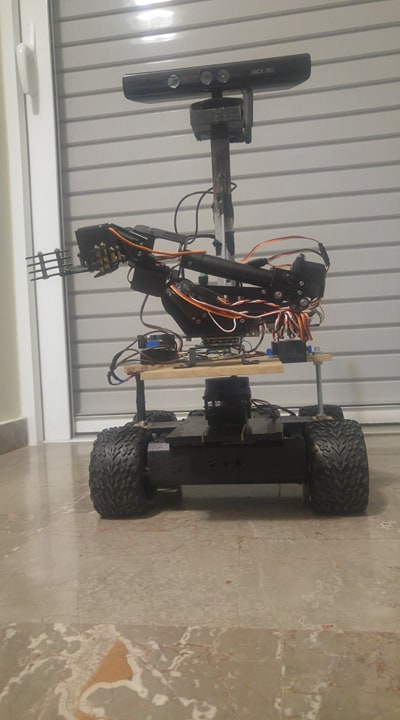
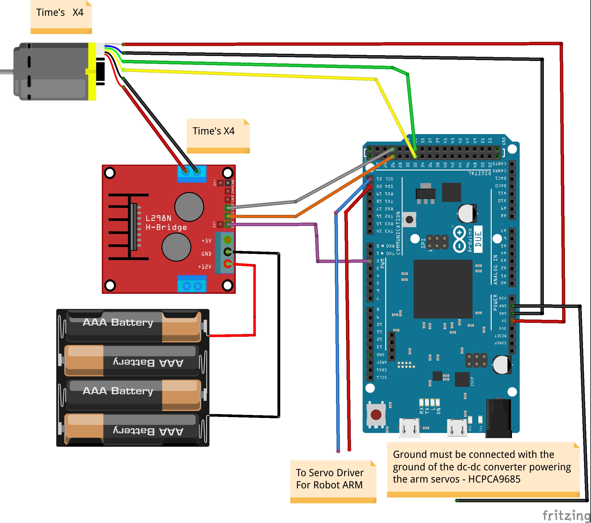

# Open Mobile Manipulator Project

### Description

This project is meant to help you with creating your own **cheap education Mobile Manipulator**,

This can help you to learn 

**Move-it, Navigation, Rtabmap, Amcl on a real robot and hardware interface and much more** 

I will try to make some Gazebo demos for all of that.

### Youtube Videos

[**Autonomous Navigation - AMCL - Move_Base- MoveIt - Video**](https://www.youtube.com/watch?v=-vyhhE-3uxY&feature=emb_logo)

[**RtabMap - 3D mapping - Localization -Robot Kidnap**](https://www.youtube.com/watch?v=4myLogrLsiE&feature=emb_logo)

### For real robot run the command

**roslaunch lynxbot_bringup lynxbot_bringup.launch**

**roslaunch lynxbot_bringup moveit.launch**

**roslaunch lynxbot_bringup gmapping.launch**

**roslaunch lynxbot_bringup teleop.launch**

**ssh -X username@192.168.1.2** (to login in the jetson)

**export ROS_MASTER_URI=**http://mia:11311/ (on the terminal to run the rviz in the PC)

**maybe export ROS_IP=192.168.1.2 accordingly on the .bashrc of the computer and jetson Nano**

### For simulation

**roslaunch lynxbot_simulation sim_bringup.launch**

**roslaunch lynxbot_bringup moveit.launch**

**roslaunch lynxbot_bringup gmapping.launch**

**roslaunch lynxbot_bringup teleop.launch**

### Compiling

**mkdir -p ~/catkin_ws/src && cd catkin_ws/src**

**git clone** https://github.com/panagelak/Open_Mobile_Manipulator.git

**git checkout master** (for sim) or **git checkout to-jetson** (for real robot on the jetson)

**cd ~/catkin_ws**

**rosdep install --from-paths src --ignore-src -r -y** (install depedencies)

**catkin_make**

### Arduino Due

Download Arduino IDE then download in the board manager the board for the due

Programming port - Arduino due , port devttyACM0 -> Upload the arduino code

**sudo usermod -a -G dialout $USER** restart

### List of materials
[Geared dc motor x4](https://www.robotshop.com/eu/en/lynxmotion-12vdc-200rpm-078kg-cm-ghm-16-w--rear-shaft.html)

[quadrature encoder x4](https://www.robotshop.com/eu/en/lynxmotion-quadrature-motor-encoder-v2-cable.html)

[arm 6 dof amazon uk](https://www.amazon.co.uk/gp/product/B07VYHFL1V/ref=ppx_yo_dt_b_asin_title_o01_s00?ie=UTF8&psc=1)

Jetson Nano ~ 100

Arduino Due ~ 30

4 L298N motor driver

3 DC-DC buck converters

2D ydlidar ~ 100

1 lipo 5000 mah battery ~ 50

1 usb wifi anttena

1 16-bit Adafruit servo shield I2c or HCPCA9685

**The total cost should be approximately 500 - 700 euro**

### Robot Base

The robot base will consist of two levels of wood e.g 40x20 cm.

In the lower level put 4 dc motor brackets (below) and make holes for the cables.

Make 8mm holes to pass through metal rods and nuts (maybe put glue too)

In the lower level put the lidar **elevated** maybe with 3 small pieces of wood and double side tape, also the arduino due,L298N and battery

In the upper level place the 3 DC-DC buck converters and Jetson Nano, arm

e.g You can make an elevated platform for kinect above the upper level with 3 extra metal threads

**BE CREATIVE**

### Contact ME

**You can contact me at panagelak12@gmail.com or panagiotis.angelakis.robot@gmail.com**

**For more assembly details or questions**

**Cheers**
